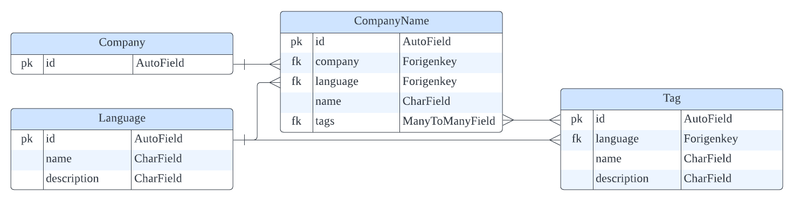

# Personal Tasks _ Wanted Lab
원티드 프리온보딩 코스 _ 개인과제 _ 원티드 랩

### Deploy GoTo

### Progress check [GoTo](https://round-locust-fc4.notion.site/wanted_lab-c118dc7316014055a311c1c38823d227)
- 요구사항 분석, 정보 기록 및 프로젝트 진행을 위해 사용

## Task interpretation
주어진 회사 정보를 포함한 데이터베이스를 설계하여 필터링 및 검색 기능을 제공하는 서비스라고 해석하였습니다.

## Implementation requirements
-   Database
    -   [x] 회사 정보에 관한 Datatbase
        -   이름(다국어 지원 가능)
    -   제공되는 DataSet 이용
    -   RDB 사용
-   REST API
    -   [x] 회사명 자동완성(이름의 일부만 들어가도 검색 가능)
    -   [x] 회사 이름으로 회사 검색기능
    -   [x] 새로운 회사 추가 기능
-   **Implementation**
    -   과제 시작일부터 48시간 이내 구현 종료
    -   유연한 확장과 성능을 고려한 설계 및 구현
    -   [x] 제공되는 test case 통과 필요
    -   [x] ORM 사용 구현 및 JSON 형식 결과 도출
    -   [x] API 명세
-   Bonus points
    -   [ ] Dockerize

## Implementation

### Tech Stack
   

### Development Period
- 2022.05.23 - 2022.05.26
- 주요 기능 구현 72시간

> ### ERD


> ### API Specification
[GoTo](https://documenter.getpostman.com/view/20879074/Uz5CKcxQ)

> ### Step to run
```
$ git clone https://github.com/Jjenny-K/wanted_lab.git

$ python -m venv venv
$ source venv/Scripts/activate
$ python install -r requirements.txt

$ python manage.py migrate --settings=config.settings.develop
$ python manage.py runserver --settings=config.settings.develop
```

## Trouble Shooting


## Author
All of development : :monkey_face: **Kang Jeonghui**
